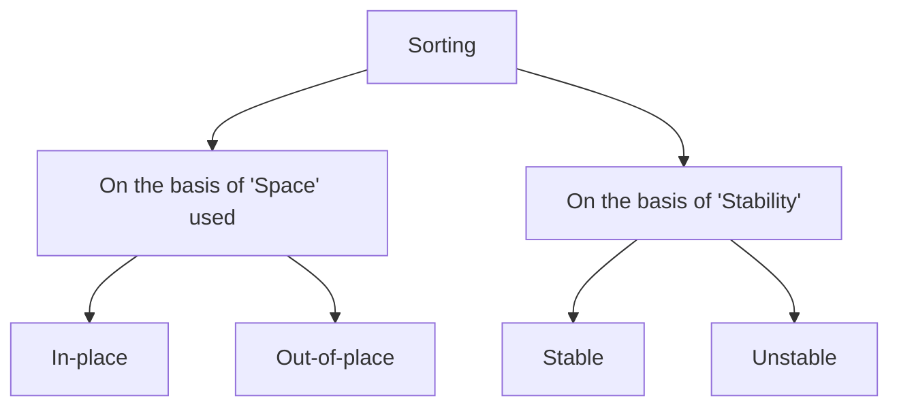

# Sorting Techniques

| Contents                                                                                |
| :-------------------------------------------------------------------------------------- |
| [Introduction](#introduction)                                                           |
| [Types of Sorting](#types-of-sorting)                                                   |
| [Sorting Terminologies](#sorting-terminologies)                                         |
| [Why Learn So Many Sorting Techniques?](#why-learn-so-many-sorting-techniques)          |
| [Sorting Algorithms](#sorting-algorithms)                                               |
| [Comparing All Types of Sorting Techniques](#comparing-all-types-of-sorting-techniques) |
| [Problems](#problems)                                                                   |

## Introduction

Sorting is a fundamental operation in computer science where elements of a list are arranged in a particular order (ascending or descending). Efficient sorting is crucial for optimizing the performance of other algorithms that require sorted data.

## Types of Sorting



### Based on Space Used

- **In-place Sorting**: Sorting algorithms that require a constant amount of extra space.
- **Out-of-place Sorting**: Sorting algorithms that require extra space proportional to the input size.

### Based on Stability

- **Stable Sorting**: Maintains the relative order of records with equal keys.
- **Unstable Sorting**: Does not maintain the relative order of records with equal keys.

## Sorting Terminologies

- **Key**: The value used to determine the order of elements.
- **Comparison**: The operation of comparing two keys.
- **Swap**: The operation of exchanging two elements.
- **Partition**: Dividing the array into sub-arrays for sorting.
- **Increasing order**: Sorting elements from the smallest to the largest.
- **Decreasing order**: Sorting elements from the largest to the smallest.
- **Non-increasing**: Sorting elements in a way that each element is not smaller than the next one.
- **Non-decreasing**: Sorting elements in a way that each element is not larger than the next one.

## Why Learn So Many Sorting Techniques?

Different sorting algorithms have different time and space complexities, making them suitable for different scenarios. Understanding multiple sorting techniques allows for selecting the most efficient algorithm based on the specific requirements of the problem.

## Sorting Algorithms

### Bubble Sort

Bubble Sort repeatedly steps through the list, compares adjacent elements, and swaps them if they are in the wrong order.

```pseudo
BubbleSort(arr):
    for i from 0 to length(arr) - 1:
        for j from 0 to length(arr) - i - 1:
            if arr[j] > arr[j + 1]:
                swap(arr[j], arr[j + 1])
```

### Selection Sort

Selection Sort divides the list into a sorted and an unsorted region, repeatedly selecting the smallest element from the unsorted region and moving it to the sorted region.

```pseudo
SelectionSort(arr):
    for i from 0 to length(arr) - 1:
        minIndex = i
        for j from i + 1 to length(arr):
            if arr[j] < arr[minIndex]:
                minIndex = j
        swap(arr[i], arr[minIndex])
```

### Insertion Sort

Insertion Sort builds the sorted array one item at a time by repeatedly picking the next item and inserting it into its correct position.

```pseudo
InsertionSort(arr):
    for i from 1 to length(arr):
        key = arr[i]
        j = i - 1
        while j >= 0 and arr[j] > key:
            arr[j + 1] = arr[j]
            j = j - 1
        arr[j + 1] = key
```

### Merge Sort

Merge Sort is a divide-and-conquer algorithm that divides the list into halves, recursively sorts them, and then merges the sorted halves.

```pseudo
MergeSort(arr):
    if length(arr) > 1:
        mid = length(arr) // 2
        leftHalf = arr[:mid]
        rightHalf = arr[mid:]
        MergeSort(leftHalf)
        MergeSort(rightHalf)
        merge(arr, leftHalf, rightHalf)

merge(arr, leftHalf, rightHalf):
    i = j = k = 0
    while i < length(leftHalf) and j < length(rightHalf):
        if leftHalf[i] < rightHalf[j]:
            arr[k] = leftHalf[i]
            i += 1
        else:
            arr[k] = rightHalf[j]
            j += 1
        k += 1
    while i < length(leftHalf):
        arr[k] = leftHalf[i]
        i += 1
        k += 1
    while j < length(rightHalf):
        arr[k] = rightHalf[j]
        j += 1
        k += 1
```

### Quick Sort

Quick Sort is a divide-and-conquer algorithm that selects a pivot element, partitions the array around the pivot, and recursively sorts the partitions.

```pseudo
QuickSort(arr, low, high):
    if low < high:
        pi = partition(arr, low, high)
        QuickSort(arr, low, pi - 1)
        QuickSort(arr, pi + 1, high)

partition(arr, low, high):
    pivot = arr[high]
    i = low - 1
    for j from low to high - 1:
        if arr[j] < pivot:
            i += 1
            swap(arr[i], arr[j])
    swap(arr[i + 1], arr[high])
    return i + 1
```

### Heap Sort

Heap Sort converts the list into a heap data structure and then repeatedly extracts the maximum element from the heap and rebuilds the heap.

```pseudo
HeapSort(arr):
    buildMaxHeap(arr)
    for i from length(arr) - 1 to 1:
        swap(arr[0], arr[i])
        heapify(arr, 0, i)

buildMaxHeap(arr):
    for i from length(arr) // 2 - 1 to 0:
        heapify(arr, i, length(arr))

heapify(arr, i, n):
    largest = i
    left = 2 * i + 1
    right = 2 * i + 2
    if left < n and arr[left] > arr[largest]:
        largest = left
    if right < n and arr[right] > arr[largest]:
        largest = right
    if largest != i:
        swap(arr[i], arr[largest])
        heapify(arr, largest, n)
```

## Comparing All Types of Sorting Techniques

| Algorithm Name | Time Complexity | Space Complexity | Stable(Y/N?) | In-place or Out-of-place |
| -------------- | --------------- | ---------------- | ------------ | ------------------------ |
| Bubble Sort    | O(n^2)          | O(1)             | Yes          | In-place                 |
| Selection Sort | O(n^2)          | O(1)             | No           | In-place                 |
| Insertion Sort | O(n^2)          | O(1)             | Yes          | In-place                 |
| Merge Sort     | O(n log n)      | O(n)             | Yes          | Out-of-place             |
| Quick Sort     | O(n log n)      | O(log n)         | No           | In-place                 |
| Heap Sort      | O(n log n)      | O(1)             | No           | In-place                 |

## Problems
