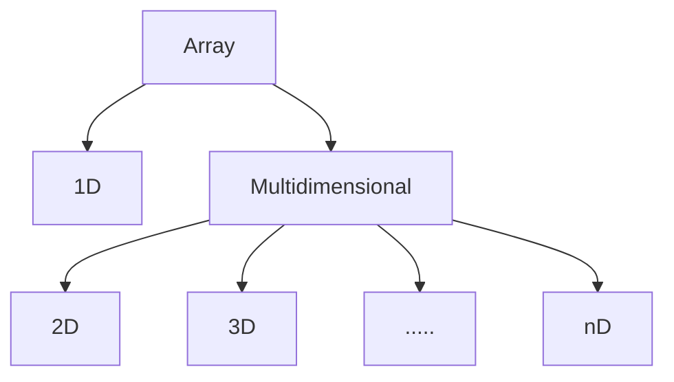

# Arrays

## Introduction

Let's take an example to understand array. If you have ever seen a box of ties, you have found a box in which small compartments are there to contain ties. So,

- Box of ties.
- All the compartments are contiguous.
- Each compartment can be identified uniquely.
- Size of the box is fixed and cannot be modified (as they come from the standard manufacturer).

Arrays can be considered similar to box of ties,

- It can store data of specified data type.
- It has contiguous memory location.
- Every cell of an array has an unique 'index'.
- Index starts with 0.
- Size of an array needs to be specified and cannot be modified.

So, to define array, it is a collection of items stored at contiguous memory locations. The idea is to store multiple items of the same type together. This makes it easier to calculate the position of each element by simply adding an offset to a base value, i.e., the memory location of the first element of the array (generally denoted by the name of the array).

```
[10, 20, 30, 40, 50, 60]
  |   |   |   |   |   |
  0   1   2   3   4   5
```

## Why do we need an Array?

**Problem Statement**

We want to store 1 million similar datatype in memory.

**Solution - 1**

We declare 1 million primitive datatype structure like integer, float, character, boolean.

*Issue - How do we maintain such a large list of variable?*

**Solution - 2**

We declare an array of size 1 million.

*Advantage - We just need to reference the cell number of the array & we can access the cell.*

## Types of Array



### One Dimensional Array

In it each element is represented by a single subscript. The elements are stored in consecutive memory location.

a[i] --> i between 0 to n

```
[10, 20, 30, 40, 50, 60]
  |   |   |   |   |   |
  0   1   2   3   4   5
```

To know more about types of array, refer below link(s):

- [Types of Arrays - CSVEDA](https://csveda.com/data-structure/types-of-arrays/)

## Array in Memory

Let's start with 1D array.

Suppose we have initiated 1D array which has 10 elements in it.

```
arr[10] = [1, 2, 3, 4, 5, 6, 7, 8, 9, 10]
```

Below is the representation of this array stored in memory(RAM). (This representation is only for understanding purposes)

|  |  |  |  |  |  |  |
| --- | --- | --- | --- | --- | --- | --- |
|  |  |  |  |  |  |  |
|  |  |  |  |  |  |  |
|  |  |  |  |  |  |  |
|  |  |  |  |  |  |  |
|  |  |  |  |  |  |  |
| 1 | 2 | 3 | 4 | 5 | 6 | 7 |
|  |  |  |  |  |  |  |
|  |  |  |  |  |  |  |
|  |  |  |  |  |  |  |
|  |  |  |  |  |  |  |
|  |  |  |  |  |  |  |
|  |  |  |  |  |  |  |

Now, when we instantiate an array of 'n' size, compiler allocates 'n' continuous cells in RAM. Please note that allocation of cells can be start from anywhere in RAM, it is not under programmer's hand but it guarantees that all these cells will be in continuos memory location.

Let's see this case in 2D array,

```
arr[5][2] = [[0, 10], [20, 30], [40, 50], [60, 70], [80, 90]]
```

In RAM, it will not store like below:

|  |  |
| --- | --- |
|  |  |
|  |  |
|  |  |
| 0 | 10 |
| 20 | 30 |
| 40 | 50 |
| 60 | 70 |
| 80 | 90 |
|  |  |
|  |  |
|  |  |
|  |  |
|  |  |

However, it will store in the same manner as seen in 1D array case,

|  |  |  |  |  |  |  |  |  |  |
| --- | --- | --- | --- | --- | --- | --- | --- | --- | --- |
|  |  |  |  |  |  |  |  |  |  |
|  |  |  |  |  |  |  |  |  |  |
|  |  |  |  |  |  |  |  |  |  |
|  |  |  |  |  |  |  |   |  |  |
|  |  |  |  |  |  |  |  |  |  |
| 0 | 10 | 20 | 30 | 40 | 50 | 60 | 70 | 80 | 90 |
|  |  |  |  |  |  |  |  |  |  |
|  |  |  |  |  |  |  |  |  |  |
|  |  |  |  |  |  |  |  |  |  |
|  |  |  |  |  |  |  |  |  |  |
|  |  |  |  |  |  |  |  |  |  |
|  |  |  |  |  |  |  |  |  |  |

Same goes for 3D and so on.

Readings:

- [CSE Engineering - NYU](https://cse.engineering.nyu.edu/~mleung/CS1114/f07/ch07/memory.htm)

## Create an Array

Creating an array basically involves below steps:

**Declare**

During declaration, we create a reference to array

**Instantiation**

During instantiation, we,

- define the datatype of elements that it will store and
- define it's size (the maximum number of elements)

**Initialization**

During initialization, we assign values to cells in array.

|  |  |  |  |  |  |  |
| --- | --- | --- | --- | --- | --- | --- |
|  |  |  |  |  |  |  |
|  |  |  |  |  |  |  |
|  |  |  |  |  |  |  |
|  |  |  |  |  |  |  |
|  |  |  |  |  |  |  |
|  | x102 | --> | 4 | 5 | 6 | 7 |
|  | arr |  | x102+0 | x102+1 | x102+2 | x102+3 |
|  |  |  |  |  |  |  |
|  |  |  |  |  |  |  |
|  |  |  |  |  |  |  |
|  |  |  |  |  |  |  |
|  |  |  |  |  |  |  |

- Once we declare array, system does not allocate memory location to it. It only creates a reference variable, Let's say, our reference variable is 'arr' which is name of an array.

- During the instantiation, compiler allocates memory to the array. After that, it stores the address of first cell in the reference variable. For instance, if the address of first cell is 'x102' then it will store the same in reference variable 'arr' and with that a link is created between 'arr' and first cell of array.

  At memory level, when we are pointing at the first cell of array, then we are saying x102 + 0, but why + 0 ?

  Because every time we want to go to the next cell, we have to increment this number from 0, 1, 2 and so on. But, for first cell there is no need for increment and that's why + 0. ***This is the reason why we start indexing of array from 0***

- During initialization, array cells are initialized with the given value (in Java, compiler gives 0 as default value to each cell of array).

So,

**Declare**

1D

```
datatype []arr ---> O(1)
eg. int []arr
```

2D

```
datatype [][]arr ---> O(1)
eg. int [][]arr
```

**Instantiation**

1D

```
array_reference_var = new datatype[size] ---> O(1)
eg. arr = new int[5]
```

2D

```
array_reference_var = new datatype[row][col] ---> O(1)
eg. arr = new int[2][3]
```

**Initialization**

1D

```
arr[0] = 10; ---> O(1)
arr[1] = 20; ---> O(1)
arr[2] = 30; ---> O(1)
```

total TC would O(n)

2D

```
arr[0][0] = 10; ---> O(1)
arr[0][1] = 20; ---> O(1)
arr[0][2] = 30; ---> O(1)
arr[1][0] = 40; ---> O(1)
arr[1][1] = 50; ---> O(1)
arr[1][2] = 60; ---> O(1)
```

total TC would O(mn)

Combining all three steps:

1D

```
int arr[] = {10, 20, 30} ---> O(1)
```

2D

```
int arr[][] = {{10, 20, 30}, {40, 50, 60}} ---> O(1)
```

## Insertion Operation

**When the location at which value to be inserted is empty (Best Time Complexity)**

1D

```
insert(arr, value_to_be_inserted, location):
    if (arr[location] is occupied)
        return error // location is already occupied
    else
        arr[location] = value_to_be_inserted
```

Time Complexity = O(1)

Space Complexity = O(1)

Example

```
arr = [10, 20, 30, 40, 50,  ,  ]
        0   1   2   3   4  5  6
```

To insert value at 6th index, do like below:

```
arr[5] = 50
```

2D

```
insert(arr, value_to_be_inserted, location):
    if (arr[row][col] is occupied)
        return error // location is already occupied
    else
        arr[row][col] = value_to_be_inserted
```

Time Complexity = O(1)

Space Complexity = O(1)

**When the location at which value to be inserted is occupied(Average or Worst Time Complexity)**

1D

```
insert(arr, value_to_be_inserted, location):
    if (arr[location] is occupied)
        // move values of each cell in next cell starting from the location
        // to create space for value_to_be_inserted
    else
        arr[location] = value_to_be_inserted
```

Time Complexity = O(n)

Space Complexity = O(1)

2D

```
insert(arr, value_to_be_inserted, location):
    if (arr[row][col] is occupied)
        // move values of each cell in next cell starting from the location
        // to create space for value_to_be_inserted
    else
        arr[row][col] = value_to_be_inserted
```

Time Complexity = O(mn)

Space Complexity = O(1)

## Problems

1. [Above average temperature](Problems/above_avg_temp.py)
2. [Missing number](Problems/missing_num.py)
3. [Two sum](Problems/two_sum.py)
4. [Is unique](Problems/is_unique.py)
5. [Permutation](Problems/permutation.py)
6. [Rotate matrix by 90 deg](Problems/rotate_matrix.py)