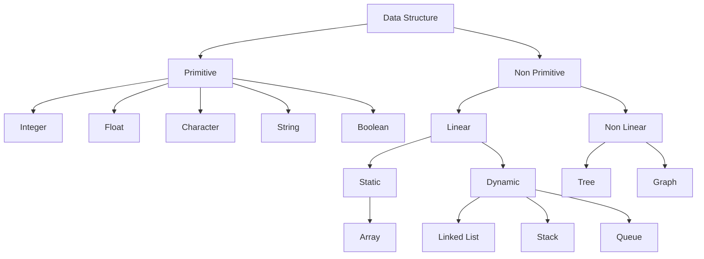

# Introduction

## What is Data Structure?

Data structure is a storage that is used to store and organize data. It is a way of arranging data on a computer so that it can be accessed and updated efficiently.

OR

Data Structures are different ways of organizing data on your computer, that can be used effectively.

Readings:

- [Data Structures - GeeksForGeeks](https://www.geeksforgeeks.org/data-structures/)

- [What are Data Structures? - Programiz](https://www.programiz.com/dsa/data-structure-types)

- [What is Data Structure? - Scalar Topics](https://www.scaler.com/topics/data-structures/what-is-data-structure/)

## What is an Algorithm?

The word Algorithm means:

A set of rules to be followed in calculations or other problem-solving operations.

OR 

A procedure for solving a mathematical problem in a finite number of steps that frequently by recursive operations.

OR

Set of rules for a computer program to accomplish a task.

A good algorithm should promote:

- Correctness

- Efficiency

### Types of Algorithms

- Simple Recursive Algorithms
- Divide and Conquer Algorithms
- Dynamic Programming Algorithms
- Greedy Algorithms
- Brute force Algorithms
- Randomized Algorithms

> Note: Please note that here we are just clustering together the algorithms that use a similar problem solving approach.

Readings:

- [What is Algorithm | Introduction to Algorithms - GeeksForGeeks](https://www.geeksforgeeks.org/introduction-to-algorithms/)

- [What is an Algorithm? - Programiz](https://www.programiz.com/dsa/algorithm)

## Why are Data Structure and Algorithms important?

Data structure and algorithms are two of the most important aspects of computer science. Data structures allow us to organize and store data, while algorithms allow us to process that data in a meaningful way. Learning data structure and algorithms will help you become a better programmer. You will be able to write code that is more efficient and more reliable. You will also be able to solve problems more quickly and more effectively.